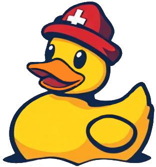

# Gummiente


What is Gummiente? The word gummiente is German for <a href="https://rubberduckdebugging.com/" target="_blank">"rubber ducky"</a>. Why German? It's a nod to my Swiss heritage. This rubber ducky is powered by Generative AI, whether local (Ollama) or some other service like OpenAI.

---

## Getting Started

First, run the development server:

```bash
npm i
npm run dev
```

Open [http://localhost:3000](http://localhost:3000) with your browser to see the result.

---
## Provider & Model Support
Currently this application supports the following providers
- OpenAI
- Ollama - Whatever you have installed. :)

More coming soon...

---

## Resources

- [NextJS]()
- [`next-themes`](https://www.npmjs.com/package/next-themes)
